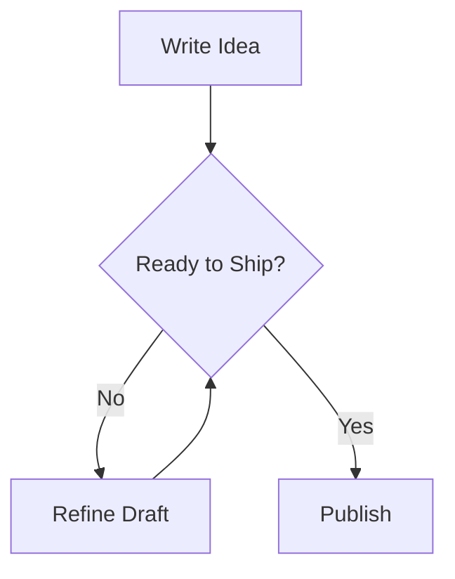

Hello there. This is where experiments sprout and blossom. Some even become features! Or they may become bugs that then
become features. Or they... well yea, stuff happens.

`Ctr-f TODO` to quickly find things I'm working on implementation. Likely in order of top to bottom.

## Typography Check

Have you heard of a "pangram story"? Supposedly they're pretty good tests for typography.

### The Curious Fox's Evening

The quick brown fox, feeling uncharacteristically reflective, juggled a dozen quirky phrases before breakfast. He zipped
across the meadow, vexing lazy dogs and dazzling every jittery jay perched on the crooked fence. By noon, he had
questioned the value of his own velocity -- how fast is fast enough, really, when time keeps leaping ahead?

As twilight arrived, the fox paused beside a pond shimmering with violet light. "Zoe's zebra quilt" he murmured,
remembering the oddest gift he'd ever received, stitched from every hue and letter imaginable. He traced the embroidered
alphabets with his paw -- A through Z, upper and lower case -- and decided perhaps the world wasn't made to be outrun,
only read carefully.

### The Typographer's Tale

A joyful mix of vowels and consonants spilled across the designer's desk, each waiting for its moment in print. "Pack my
box with five dozen liquor jugs", she whispered -- the old standby -- then laughed, unsatisfied. She needed something
wilder, something that stretched the tails of the g, y, and q without breaking the harmony of the line.

She tried again: "Jovial zebras quickly faxed quirky diplomas while vexed owls judged the kerning". Better. The counters
breathed, the ligatures sang, and the spacing shimmered like music. The typeface, for a fleeting second, felt alive.

### Pangram Prose

Sphinx of black quartz, judge my vow! A phrase both noble and nonsensical, yet it tests every serif and stroke. Jackdaws
love my big sphinx of quartz -- another line that rolls through diagonals, bowls, and crossbars. The typist's fingers
flutter like a pianist's, exploring how each curve meets its neighbor.

Meanwhile, the jaded wizard quickly vexes the bold dwarf. The vowels glow, the descenders dip, and punctuation
pirouettes between words: commas, colons, semicolons -- all demand balance. For font makers, this is meditation in
motion: every line a microcosm of contrast, texture, and rhythm.

## Testing MDX

This section is here to make sure we can render richer MDX content cleanly, including interactive
examples, figures, and code blocks.

### Jakub

These first examples are my rendition of [Details That Make Interfaces Feel
Better](https://jakub.kr/writing/details-that-make-interfaces-feel-better) by
[Jakub](https://jakub.kr/).

#### Make Text Crispy

On `macOS`, text rendering can sometimes appear heavier than intended.

<FontSmoothingPlayground />

Setting `-webkit-font-smoothing: antialiased` or just `antialiased` in Tailwind makes text render
slightly thinner and crisper.

```html
<html lang="en">
  <body class="font-sans antialiased">
    <main>{children}</main>
  </body>
</html>
```

The best way to apply this is to add it to the entire layout. That way it applies to all of the
text elements in your app.

#### Tabular Numbers

If your numbers shift when they update, use `font-variant-numeric: tabular-nums`.
In Tailwind, use `tabular-nums`.

<figure>
  <TabularNumbersPlayground />

  <figcaption>Press play to compare how the digits hold their width.</figcaption>
</figure>

It makes the digits equal width. Keep in mind that some fonts change the look of numerals when this
property is enabled.

#### Align Optically, Not Geometrically

Aligning items geometrically works great most of the time, but there are instances where it just
looks off. When that happens, it is best to align items optically instead.

<OpticalAlignmentPlayground />

For example, when a button has both text and an icon, it is better to have a slightly smaller
padding on the side of the icon to optically align the content.

<figure>
  <OpticalPlayAlignmentPlayground />

  <figcaption>
    Change the alignment mode to compare the play icon inside a circular button. In this version,
    only the icon is optically aligned.
  </figcaption>
</figure>

This often happens with icons. While a lot of icon packs already account for this, there are shapes
that still need to be optically aligned. I usually fix it by adjusting `margin` or `padding`
depending on the container.

<figure>
  <OpticalStarAlignmentPlayground />

  <figcaption>Change the alignment mode and click the button to see the difference.</figcaption>
</figure>

For icons, the best way to fix it is in the `svg` itself, so no additional `margin` or `padding`
needs to be added.

## Images

<figure>
  

  <figcaption>Pretty but slow to load</figcaption>
</figure>

<figure>
  

  <figcaption>Stuffs</figcaption>
</figure>

<figure>
  

  <figcaption>Saturday Vibes [(from Tenor)](https://tenor.com/view/fat-albert-saturday-gif-9828130470404483091)</figcaption>
</figure>

<figure>
  
  <figcaption>An elephant at sunset</figcaption>
</figure>

## Video

<figure>
   <video
      controls
      src="https://archive.org/download/BigBuckBunny_124/Content/big_buck_bunny_720p_surround.mp4"
      poster="https://peach.blender.org/wp-content/uploads/title_anouncement.jpg?x11217"
      width="620">
      Sorry, your browser doesn't support embedded videos, but don't worry, you can
      <a href="https://archive.org/details/BigBuckBunny_124">download it</a>
      and watch it with your favorite video player!
   </video>

   <figcaption>
      Example 1 from [MDN](https://developer.mozilla.org/en-US/docs/Web/HTML/Element/video#examples)
   </figcaption>
</figure>

<figure>
   <video
      width="620"
      controls
      poster="https://upload.wikimedia.org/wikipedia/commons/e/e8/Elephants_Dream_s5_both.jpg">
      <source
         src="https://archive.org/download/ElephantsDream/ed_hd.avi"
         type="video/avi" />
      <source
         src="https://archive.org/download/ElephantsDream/ed_1024_512kb.mp4"
         type="video/mp4" />
      Sorry, your browser doesn't support embedded videos, but don't worry, you can
      <a
         href="https://archive.org/download/ElephantsDream/ed_1024_512kb.mp4"
         download="ed_1024_512kb.mp4">
      download the MP4
      </a>
      and watch it with your favorite video player!
   </video>

   <figcaption>
      Example 2 from [MDN](https://developer.mozilla.org/en-US/docs/Web/HTML/Element/video#examples)
   </figcaption>
</figure>

## Tabs

<TabsRoot defaultValue="html" className="mx-auto">
  <TabsList aria-label="Frontend stack layers">
    <TabsTab value="html">HTML</TabsTab>
    <TabsTab value="css">CSS</TabsTab>
    <TabsTab value="js">JavaScript</TabsTab>
    <TabsIndicator />
  </TabsList>

  <TabsPanel value="html" className="h-auto items-start justify-start p-4">
    HTML is the structure. It gives the browser the bones: headings, paragraphs, buttons, figures,
    and enough semantic shape for everything else to have a place to live.
  </TabsPanel>

  <TabsPanel value="css" className="h-auto items-start justify-start p-4">
    CSS handles presentation. Spacing, color, typography, layout, and motion all land here,
    ideally without leaking too much stateful behavior into style alone.
  </TabsPanel>

  <TabsPanel value="js" className="h-auto items-start justify-start p-4">
    JavaScript brings behavior. It coordinates state, events, and richer interactions like this tab
    switcher without forcing everything else to become imperative soup.
  </TabsPanel>
</TabsRoot>

### Tabbed Text and Code Blocks

<TabsRoot defaultValue="ts" className="mx-auto">
  <TabsList aria-label="Greeting examples with descriptions">
    <TabsTab value="js">JavaScript</TabsTab>
    <TabsTab value="ts">TypeScript</TabsTab>
    <TabsIndicator />
  </TabsList>

  <TabsPanel value="js" className="h-auto items-start justify-start p-0">

  <TabbifyPanel>

JavaScript version with no explicit type annotations.

```js
export function greeting(user) {
  return `Hello, ${user.name}`
}
```

  </TabbifyPanel>

  </TabsPanel>

  <TabsPanel value="ts" className="h-auto items-start justify-start p-0">

  <TabbifyPanel>

TypeScript version with an explicit `User` type.

```ts
type User = {
  id: string
  name: string
}

export function greeting(user: User) {
  return `Hello, ${user.name}`
}
```

  </TabbifyPanel>

  </TabsPanel>
</TabsRoot>

## Callouts

> [!NOTE] Note
>
> Highlights information that users should take into account, even when skimming.
>
> Second paragraph. With a [lorem ipsum](#) link.
>
> Some `backticks` for inline.
>
> ```javascript
> backtick.fences("for blocks")
> ```
>
> ```js
> import * as React from "react"
> import { ScrollArea } from "@base-ui/react/scroll-area"
>
> export default function ExampleScrollArea() {
>   return (
>     <ScrollArea.Root className="h-[8.5rem] w-96 max-w-[calc(100vw-8rem)]">
>       <ScrollArea.Viewport className="outline-gray-200 focus-visible:outline-blue-800 h-full overscroll-contain rounded-md outline outline-1 -outline-offset-1 focus-visible:outline focus-visible:outline-2">
>         <div className="text-sm text-gray-900 flex flex-col gap-4 py-3 pr-6 pl-4 leading-[1.375rem]">
>           <p>
>             Vernacular architecture is building done outside any academic tradition, and without
>             professional guidance. It is not a particular architectural movement or style, but
>             rather a broad category, encompassing a wide range and variety of building types, with
>             differing methods of construction, from around the world, both historical and extant
>             and classical and modern. Vernacular architecture constitutes 95% of the world's built
>             environment, as estimated in 1995 by Amos Rapoport, as measured against the small
>             percentage of new buildings every year designed by architects and built by engineers.
>           </p>
>           <p>
>             This type of architecture usually serves immediate, local needs, is constrained by the
>             materials available in its particular region and reflects local traditions and
>             cultural practices. The study of vernacular architecture does not examine formally
>             schooled architects, but instead that of the design skills and tradition of local
>             builders, who were rarely given any attribution for the work. More recently,
>             vernacular architecture has been examined by designers and the building industry in an
>             effort to be more energy conscious with contemporary design and construction—part of a
>             broader interest in sustainable design.
>           </p>
>         </div>
>       </ScrollArea.Viewport>
>       <ScrollArea.Scrollbar className="bg-gray-200 pointer-events-none m-2 flex w-1 justify-center rounded opacity-0 transition-opacity delay-300 data-[hovering]:pointer-events-auto data-[hovering]:opacity-100 data-[hovering]:delay-0 data-[hovering]:duration-75 data-[scrolling]:pointer-events-auto data-[scrolling]:opacity-100 data-[scrolling]:delay-0 data-[scrolling]:duration-75">
>         <ScrollArea.Thumb className="bg-gray-500 w-full rounded" />
>       </ScrollArea.Scrollbar>
>     </ScrollArea.Root>
>   )
> }
> ```

> [!TIP] Tip
>
> Optional information to help a user be more successful.
>
> Second paragraph. With a [lorem ipsum](#) link.
>
> Some `backticks` for inline.
>
> ```javascript
> backtick.fences("for blocks")
> ```
>
> ```js
> import * as React from "react"
> import { ScrollArea } from "@base-ui/react/scroll-area"
>
> export default function ExampleScrollArea() {
>   return (
>     <ScrollArea.Root className="h-[8.5rem] w-96 max-w-[calc(100vw-8rem)]">
>       <ScrollArea.Viewport className="outline-gray-200 focus-visible:outline-blue-800 h-full overscroll-contain rounded-md outline outline-1 -outline-offset-1 focus-visible:outline focus-visible:outline-2">
>         <div className="text-sm text-gray-900 flex flex-col gap-4 py-3 pr-6 pl-4 leading-[1.375rem]">
>           <p>
>             Vernacular architecture is building done outside any academic tradition, and without
>             professional guidance. It is not a particular architectural movement or style, but
>             rather a broad category, encompassing a wide range and variety of building types, with
>             differing methods of construction, from around the world, both historical and extant
>             and classical and modern. Vernacular architecture constitutes 95% of the world's built
>             environment, as estimated in 1995 by Amos Rapoport, as measured against the small
>             percentage of new buildings every year designed by architects and built by engineers.
>           </p>
>           <p>
>             This type of architecture usually serves immediate, local needs, is constrained by the
>             materials available in its particular region and reflects local traditions and
>             cultural practices. The study of vernacular architecture does not examine formally
>             schooled architects, but instead that of the design skills and tradition of local
>             builders, who were rarely given any attribution for the work. More recently,
>             vernacular architecture has been examined by designers and the building industry in an
>             effort to be more energy conscious with contemporary design and construction—part of a
>             broader interest in sustainable design.
>           </p>
>         </div>
>       </ScrollArea.Viewport>
>       <ScrollArea.Scrollbar className="bg-gray-200 pointer-events-none m-2 flex w-1 justify-center rounded opacity-0 transition-opacity delay-300 data-[hovering]:pointer-events-auto data-[hovering]:opacity-100 data-[hovering]:delay-0 data-[hovering]:duration-75 data-[scrolling]:pointer-events-auto data-[scrolling]:opacity-100 data-[scrolling]:delay-0 data-[scrolling]:duration-75">
>         <ScrollArea.Thumb className="bg-gray-500 w-full rounded" />
>       </ScrollArea.Scrollbar>
>     </ScrollArea.Root>
>   )
> }
> ```

> [!IMPORTANT] Important
>
> Crucial information necessary for users to succeed.
>
> Second paragraph. With a [lorem ipsum](#) link.
>
> Some `backticks` for inline.
>
> ```javascript
> backtick.fences("for blocks")
> ```
>
> ```js
> import * as React from "react"
> import { ScrollArea } from "@base-ui/react/scroll-area"
>
> export default function ExampleScrollArea() {
>   return (
>     <ScrollArea.Root className="h-[8.5rem] w-96 max-w-[calc(100vw-8rem)]">
>       <ScrollArea.Viewport className="outline-gray-200 focus-visible:outline-blue-800 h-full overscroll-contain rounded-md outline outline-1 -outline-offset-1 focus-visible:outline focus-visible:outline-2">
>         <div className="text-sm text-gray-900 flex flex-col gap-4 py-3 pr-6 pl-4 leading-[1.375rem]">
>           <p>
>             Vernacular architecture is building done outside any academic tradition, and without
>             professional guidance. It is not a particular architectural movement or style, but
>             rather a broad category, encompassing a wide range and variety of building types, with
>             differing methods of construction, from around the world, both historical and extant
>             and classical and modern. Vernacular architecture constitutes 95% of the world's built
>             environment, as estimated in 1995 by Amos Rapoport, as measured against the small
>             percentage of new buildings every year designed by architects and built by engineers.
>           </p>
>           <p>
>             This type of architecture usually serves immediate, local needs, is constrained by the
>             materials available in its particular region and reflects local traditions and
>             cultural practices. The study of vernacular architecture does not examine formally
>             schooled architects, but instead that of the design skills and tradition of local
>             builders, who were rarely given any attribution for the work. More recently,
>             vernacular architecture has been examined by designers and the building industry in an
>             effort to be more energy conscious with contemporary design and construction—part of a
>             broader interest in sustainable design.
>           </p>
>         </div>
>       </ScrollArea.Viewport>
>       <ScrollArea.Scrollbar className="bg-gray-200 pointer-events-none m-2 flex w-1 justify-center rounded opacity-0 transition-opacity delay-300 data-[hovering]:pointer-events-auto data-[hovering]:opacity-100 data-[hovering]:delay-0 data-[hovering]:duration-75 data-[scrolling]:pointer-events-auto data-[scrolling]:opacity-100 data-[scrolling]:delay-0 data-[scrolling]:duration-75">
>         <ScrollArea.Thumb className="bg-gray-500 w-full rounded" />
>       </ScrollArea.Scrollbar>
>     </ScrollArea.Root>
>   )
> }
> ```

> [!WARNING] Warning
>
> Critical content demanding immediate user attention due to potential risks.
>
> Second paragraph. With a [lorem ipsum](#) link.
>
> Some `backticks` for inline.
>
> ```javascript
> backtick.fences("for blocks")
> ```
>
> ```js
> import * as React from "react"
> import { ScrollArea } from "@base-ui/react/scroll-area"
>
> export default function ExampleScrollArea() {
>   return (
>     <ScrollArea.Root className="h-[8.5rem] w-96 max-w-[calc(100vw-8rem)]">
>       <ScrollArea.Viewport className="outline-gray-200 focus-visible:outline-blue-800 h-full overscroll-contain rounded-md outline outline-1 -outline-offset-1 focus-visible:outline focus-visible:outline-2">
>         <div className="text-sm text-gray-900 flex flex-col gap-4 py-3 pr-6 pl-4 leading-[1.375rem]">
>           <p>
>             Vernacular architecture is building done outside any academic tradition, and without
>             professional guidance. It is not a particular architectural movement or style, but
>             rather a broad category, encompassing a wide range and variety of building types, with
>             differing methods of construction, from around the world, both historical and extant
>             and classical and modern. Vernacular architecture constitutes 95% of the world's built
>             environment, as estimated in 1995 by Amos Rapoport, as measured against the small
>             percentage of new buildings every year designed by architects and built by engineers.
>           </p>
>           <p>
>             This type of architecture usually serves immediate, local needs, is constrained by the
>             materials available in its particular region and reflects local traditions and
>             cultural practices. The study of vernacular architecture does not examine formally
>             schooled architects, but instead that of the design skills and tradition of local
>             builders, who were rarely given any attribution for the work. More recently,
>             vernacular architecture has been examined by designers and the building industry in an
>             effort to be more energy conscious with contemporary design and construction—part of a
>             broader interest in sustainable design.
>           </p>
>         </div>
>       </ScrollArea.Viewport>
>       <ScrollArea.Scrollbar className="bg-gray-200 pointer-events-none m-2 flex w-1 justify-center rounded opacity-0 transition-opacity delay-300 data-[hovering]:pointer-events-auto data-[hovering]:opacity-100 data-[hovering]:delay-0 data-[hovering]:duration-75 data-[scrolling]:pointer-events-auto data-[scrolling]:opacity-100 data-[scrolling]:delay-0 data-[scrolling]:duration-75">
>         <ScrollArea.Thumb className="bg-gray-500 w-full rounded" />
>       </ScrollArea.Scrollbar>
>     </ScrollArea.Root>
>   )
> }
> ```

> [!CAUTION] Caution
>
> Negative potential consequences of an action.
>
> Second paragraph. With a [lorem ipsum](#) link.
>
> Some `backticks` for inline.
>
> ```javascript
> backtick.fences("for blocks")
> ```
>
> ```js
> import * as React from "react"
> import { ScrollArea } from "@base-ui/react/scroll-area"
>
> export default function ExampleScrollArea() {
>   return (
>     <ScrollArea.Root className="h-[8.5rem] w-96 max-w-[calc(100vw-8rem)]">
>       <ScrollArea.Viewport className="outline-gray-200 focus-visible:outline-blue-800 h-full overscroll-contain rounded-md outline outline-1 -outline-offset-1 focus-visible:outline focus-visible:outline-2">
>         <div className="text-sm text-gray-900 flex flex-col gap-4 py-3 pr-6 pl-4 leading-[1.375rem]">
>           <p>
>             Vernacular architecture is building done outside any academic tradition, and without
>             professional guidance. It is not a particular architectural movement or style, but
>             rather a broad category, encompassing a wide range and variety of building types, with
>             differing methods of construction, from around the world, both historical and extant
>             and classical and modern. Vernacular architecture constitutes 95% of the world's built
>             environment, as estimated in 1995 by Amos Rapoport, as measured against the small
>             percentage of new buildings every year designed by architects and built by engineers.
>           </p>
>           <p>
>             This type of architecture usually serves immediate, local needs, is constrained by the
>             materials available in its particular region and reflects local traditions and
>             cultural practices. The study of vernacular architecture does not examine formally
>             schooled architects, but instead that of the design skills and tradition of local
>             builders, who were rarely given any attribution for the work. More recently,
>             vernacular architecture has been examined by designers and the building industry in an
>             effort to be more energy conscious with contemporary design and construction—part of a
>             broader interest in sustainable design.
>           </p>
>         </div>
>       </ScrollArea.Viewport>
>       <ScrollArea.Scrollbar className="bg-gray-200 pointer-events-none m-2 flex w-1 justify-center rounded opacity-0 transition-opacity delay-300 data-[hovering]:pointer-events-auto data-[hovering]:opacity-100 data-[hovering]:delay-0 data-[hovering]:duration-75 data-[scrolling]:pointer-events-auto data-[scrolling]:opacity-100 data-[scrolling]:delay-0 data-[scrolling]:duration-75">
>         <ScrollArea.Thumb className="bg-gray-500 w-full rounded" />
>       </ScrollArea.Scrollbar>
>     </ScrollArea.Root>
>   )
> }
> ```

And nesting callouts

> [!WARNING] Warning
>
> Critical content demanding immediate user attention due to potential risks.
>
> Second paragraph. With a [lorem ipsum](#) link.
>
> > [!CAUTION] Caution
> >
> > Negative potential consequences of an action.
> >
> > Second paragraph. With a [lorem ipsum](#) link.

> [!CAUTION] Caution
>
> Negative potential consequences of an action.
>
> Second paragraph. With a [lorem ipsum](#) link.
>
> > [!WARNING] Warning
> >
> > Critical content demanding immediate user attention due to potential risks.
> >
> > Second paragraph. With a [lorem ipsum](#) link.

and this continues the paragraph.

> [!QUOTE]
>
> This is another quote that is long enough to be on multiple lines. Let's see how it looks. And just to make sure it's long enough, I'll add some more text. Just a bit more.

but also without any variant

> This is another quote that is long enough to be on multiple lines. Let's see how it looks. And just to make sure it's long enough, I'll add some more text. Just a bit more.

and nested

> Level-one reply
>
> > Level-two reply
> >
> > > Level-three reply

and now a quote with a caption:

<figure>

> [!QUOTE]
>
> The truth may be puzzling. It may take some work to grapple with. It may be counterintuitive. It may contradict
> deeply held prejudices. It may not be consonant with what we desperately want to be true. But our preferences do not
> determine what's true. We have a method, and that method helps us to reach not absolute truth, only asymptotic
> approaches to the truth -- never there, just closer and closer, always finding vast new oceans of undiscovered
> possibilities. Cleverly designed experiments are the key.

  <figcaption>

    Carl Sagan, in "<cite>Wonder and Skepticism</cite>", from the <cite>Skeptical Inquirer</cite>
    Volume 19, Issue 1 (January-February 1995)

  </figcaption>
</figure>

## Basic Text Formatting

_This text is italicized._

**This text is bold.**

~This text is _not_ strikethrough.~

~~This text is strikethrough.~~

_**This text is bold and italicized.**_

## Compound Formatting

**_This is bold and italicized text._**

~~**This is bold and strikethrough text.**~~

> **This is a blockquote with bold text.**

Here is a list with different formatting:

1. **Bold Item**
2. _Italicized Item_
3. ~~Strikethrough Item~~
4. **_Bold and Italicized Item_**

## Extended Formatting

- TODO
  - subscript: H_2_O
  - superscript: X^2

### Mermaid

Code block only:



Rendered diagram:

<figure>


  <figcaption>A simple workflow.</figcaption>
</figure>

### Math

Inline math `e^{i\pi} + 1 = 0` becomes $e^{i\pi} + 1 = 0$.

Display math:

$$
\int_{-\infty}^{\infty} e^{-x^2} \, dx = \sqrt{\pi}
$$

Code block only:

```latex
$$
\int_{-\infty}^{\infty} e^{-x^2} \, dx = \sqrt{\pi}
$$
```

Rendered code block:

```latex render
\int_{-\infty}^{\infty} e^{-x^2} \, dx = \sqrt{\pi}
```

## Spoilers

Don't you just hate <Spoiler>spoilers</Spoiler>?

Also, <Spoiler>this is some spoiler that's far too long to fit in one line when listed on a page. Some extra nonsense at the end to ensure it wraps to a second line. Should have wrapped by now...</Spoiler>

How about with... markup? <Spoiler>this is _italics_ and **bold** and _underline_ and **_something_**</Spoiler>.

TODO: absolutely failing --

...how about a formatting spoiler? <Spoiler>a [link home](/) and [external link to Google](https://google.com)</Spoiler>

## Links

This is an [internal link](/writings) example.

This is an [external link](https://google.com) example.

This is an [internal anchor link](#links) example.

This is an [internal link to file](/og.png) example.

This is an [external link to file](https://google.com/example.pdf) example.

## Lists

### Unordered List

- Item 1
  - Sub-item 1
  - Sub-item 2
- Item 2
  - Sub-item 1
  - Sub-item 2
    - Sub-sub-item 1
    - Sub-sub-item 2
- Item 3

### Ordered List

1. First item
   1. Sub-item 1
   2. Sub-item 2
2. Second item
   1. Sub-item 1
   2. Sub-item 2
      1. Sub-sub-item 1
      2. Sub-sub-item 2
3. Third item

## Headers

Lorem ipsum dolor sit amet, consectetur adipiscing elit. Sed dignissim arcu sit amet ullamcorper malesuada. Phasellus
quis posuere sem, nec euismod nisi. Quisque a risus fermentum, venenatis elit ac, mattis magna. Nulla facilisi. Donec
mauris leo, viverra et erat at, sollicitudin interdum mi. Phasellus cursus orci vel eleifend viverra. Curabitur eleifend
tristique ipsum eu sagittis. Quisque vitae augue cursus, luctus nisi vitae, mattis neque. Aenean euismod erat sed eros
consequat, sed elementum justo luctus. Cras faucibus id ex in ornare. Vestibulum ante ipsum primis in faucibus orci
luctus et ultrices posuere cubilia curae;

### Header 3

Lorem ipsum dolor sit amet, consectetur adipiscing elit. Sed dignissim arcu sit amet ullamcorper malesuada. Phasellus
quis posuere sem, nec euismod nisi. Quisque a risus fermentum, venenatis elit ac, mattis magna. Nulla facilisi. Donec
mauris leo, viverra et erat at, sollicitudin interdum mi. Phasellus cursus orci vel eleifend viverra. Curabitur eleifend
tristique ipsum eu sagittis. Quisque vitae augue cursus, luctus nisi vitae, mattis neque. Aenean euismod erat sed eros
consequat, sed elementum justo luctus. Cras faucibus id ex in ornare. Vestibulum ante ipsum primis in faucibus orci
luctus et ultrices posuere cubilia curae;

#### Header 4

Lorem ipsum dolor sit amet, consectetur adipiscing elit. Sed dignissim arcu sit amet ullamcorper malesuada. Phasellus
quis posuere sem, nec euismod nisi. Quisque a risus fermentum, venenatis elit ac, mattis magna. Nulla facilisi. Donec
mauris leo, viverra et erat at, sollicitudin interdum mi. Phasellus cursus orci vel eleifend viverra. Curabitur eleifend
tristique ipsum eu sagittis. Quisque vitae augue cursus, luctus nisi vitae, mattis neque. Aenean euismod erat sed eros
consequat, sed elementum justo luctus. Cras faucibus id ex in ornare. Vestibulum ante ipsum primis in faucibus orci
luctus et ultrices posuere cubilia curae;

#### Excerpt

This should have an id of `excerpt-1` if mark excerpt plugin is active.

Lorem ipsum dolor sit amet, consectetur adipiscing elit. Sed dignissim arcu sit amet ullamcorper malesuada. Phasellus
quis posuere sem, nec euismod nisi. Quisque a risus fermentum, venenatis elit ac, mattis magna. Nulla facilisi. Donec
mauris leo, viverra et erat at, sollicitudin interdum mi. Phasellus cursus orci vel eleifend viverra. Curabitur eleifend
tristique ipsum eu sagittis. Quisque vitae augue cursus, luctus nisi vitae, mattis neque. Aenean euismod erat sed eros
consequat, sed elementum justo luctus. Cras faucibus id ex in ornare. Vestibulum ante ipsum primis in faucibus orci
luctus et ultrices posuere cubilia curae;

### This is a really long one ugh, like really really long to test wrapping and the sort (should be at Header 3 depth)

Mauris ac convallis ligula. Phasellus nec ultricies libero, vel bibendum nunc. Ut id nibh leo. Pellentesque cursus nunc
non facilisis ultrices. Praesent vel fermentum nibh. Orci varius natoque penatibus et magnis dis parturient montes,
nascetur ridiculus mus. Etiam quis vulputate sapien, vitae vehicula odio. Nunc eget ante vitae nibh aliquet
euismod. Vestibulum sagittis lacinia urna, nec dapibus purus sollicitudin in. Proin accumsan arcu leo, id egestas tellus
tristique vel. Mauris ultricies luctus maximus. Nullam blandit lacinia felis, sed placerat sem sagittis varius. Sed ut
arcu nec massa molestie fermentum vitae quis sem. Etiam id urna quis ipsum volutpat tempus et vel felis.

Vivamus vel bibendum eros. Nulla varius faucibus ex, nec congue urna ornare sit amet. Pellentesque in elit aliquam est
vehicula scelerisque ac vel risus. Nulla facilisis nec mauris ac fringilla. Cras dignissim ultricies vulputate. Nam a
odio lorem. Integer sit amet velit libero. Sed convallis ex sit amet nibh blandit, id facilisis velit luctus. Aliquam
erat volutpat. Mauris tincidunt lacinia erat, quis pellentesque nisl.

Proin dapibus mollis libero id viverra. Proin efficitur id nunc vitae semper. Aenean feugiat pulvinar eros vitae
dictum. Donec tincidunt facilisis fringilla. Sed semper suscipit dictum. Etiam sed quam at sem egestas convallis at quis
eros. Mauris et laoreet odio. Ut orci dui, malesuada pretium iaculis id, pretium eget magna. Etiam tellus est, imperdiet
in posuere sed, venenatis venenatis eros. Mauris risus est, suscipit eu luctus a, pellentesque nec tellus. Sed quis urna
fringilla, vestibulum urna id, dictum arcu. Mauris lectus odio, faucibus eget est at, maximus sodales ipsum.

#### Header 4

This is a repeat heading from right above, check to see id is different and toc works.

Lorem ipsum dolor sit amet, consectetur adipiscing elit. Sed dignissim arcu sit amet ullamcorper malesuada. Phasellus
quis posuere sem, nec euismod nisi. Quisque a risus fermentum, venenatis elit ac, mattis magna. Nulla facilisi. Donec
mauris leo, viverra et erat at, sollicitudin interdum mi. Phasellus cursus orci vel eleifend viverra. Curabitur eleifend
tristique ipsum eu sagittis. Quisque vitae augue cursus, luctus nisi vitae, mattis neque. Aenean euismod erat sed eros
consequat, sed elementum justo luctus. Cras faucibus id ex in ornare. Vestibulum ante ipsum primis in faucibus orci
luctus et ultrices posuere cubilia curae;

##### Header 5

Lorem ipsum dolor sit amet, consectetur adipiscing elit. Sed dignissim arcu sit amet ullamcorper malesuada. Phasellus
quis posuere sem, nec euismod nisi. Quisque a risus fermentum, venenatis elit ac, mattis magna. Nulla facilisi. Donec
mauris leo, viverra et erat at, sollicitudin interdum mi. Phasellus cursus orci vel eleifend viverra. Curabitur eleifend
tristique ipsum eu sagittis. Quisque vitae augue cursus, luctus nisi vitae, mattis neque. Aenean euismod erat sed eros
consequat, sed elementum justo luctus. Cras faucibus id ex in ornare. Vestibulum ante ipsum primis in faucibus orci
luctus et ultrices posuere cubilia curae;

###### Header 6

Mauris ac convallis ligula. Phasellus nec ultricies libero, vel bibendum nunc. Ut id nibh leo. Pellentesque cursus nunc
non facilisis ultrices. Praesent vel fermentum nibh. Orci varius natoque penatibus et magnis dis parturient montes,
nascetur ridiculus mus. Etiam quis vulputate sapien, vitae vehicula odio. Nunc eget ante vitae nibh aliquet
euismod. Vestibulum sagittis lacinia urna, nec dapibus purus sollicitudin in. Proin accumsan arcu leo, id egestas tellus
tristique vel. Mauris ultricies luctus maximus. Nullam blandit lacinia felis, sed placerat sem sagittis varius. Sed ut
arcu nec massa molestie fermentum vitae quis sem. Etiam id urna quis ipsum volutpat tempus et vel felis.

Vivamus vel bibendum eros. Nulla varius faucibus ex, nec congue urna ornare sit amet. Pellentesque in elit aliquam est
vehicula scelerisque ac vel risus. Nulla facilisis nec mauris ac fringilla. Cras dignissim ultricies vulputate. Nam a
odio lorem. Integer sit amet velit libero. Sed convallis ex sit amet nibh blandit, id facilisis velit luctus. Aliquam
erat volutpat. Mauris tincidunt lacinia erat, quis pellentesque nisl.

Proin dapibus mollis libero id viverra. Proin efficitur id nunc vitae semper. Aenean feugiat pulvinar eros vitae
dictum. Donec tincidunt facilisis fringilla. Sed semper suscipit dictum. Etiam sed quam at sem egestas convallis at quis
eros. Mauris et laoreet odio. Ut orci dui, malesuada pretium iaculis id, pretium eget magna. Etiam tellus est, imperdiet
in posuere sed, venenatis venenatis eros. Mauris risus est, suscipit eu luctus a, pellentesque nec tellus. Sed quis urna
fringilla, vestibulum urna id, dictum arcu. Mauris lectus odio, faucibus eget est at, maximus sodales ipsum.

## Codeblocks

### Inline Code

Because `code` should exist within words too. Awkward if the next line also had a `codeblock` (for safety sake, a second
`codeblocks`) and the blocks touched :pensive:

### Hmmm

Some `backticks` for inline.

```javascript
backtick.fences("for blocks")
```

```js
import * as React from "react"
import { ScrollArea } from "@base-ui/react/scroll-area"

export default function ExampleScrollArea() {
  return (
    <ScrollArea.Root className="h-[8.5rem] w-96 max-w-[calc(100vw-8rem)]">
      <ScrollArea.Viewport className="outline-gray-200 focus-visible:outline-blue-800 h-full overscroll-contain rounded-md outline outline-1 -outline-offset-1 focus-visible:outline focus-visible:outline-2">
        <div className="text-sm text-gray-900 flex flex-col gap-4 py-3 pr-6 pl-4 leading-[1.375rem]">
          <p>
            Vernacular architecture is building done outside any academic tradition, and without
            professional guidance. It is not a particular architectural movement or style, but
            rather a broad category, encompassing a wide range and variety of building types, with
            differing methods of construction, from around the world, both historical and extant and
            classical and modern. Vernacular architecture constitutes 95% of the world's built
            environment, as estimated in 1995 by Amos Rapoport, as measured against the small
            percentage of new buildings every year designed by architects and built by engineers.
          </p>
          <p>
            This type of architecture usually serves immediate, local needs, is constrained by the
            materials available in its particular region and reflects local traditions and cultural
            practices. The study of vernacular architecture does not examine formally schooled
            architects, but instead that of the design skills and tradition of local builders, who
            were rarely given any attribution for the work. More recently, vernacular architecture
            has been examined by designers and the building industry in an effort to be more energy
            conscious with contemporary design and construction—part of a broader interest in
            sustainable design.
          </p>
        </div>
      </ScrollArea.Viewport>
      <ScrollArea.Scrollbar className="bg-gray-200 pointer-events-none m-2 flex w-1 justify-center rounded opacity-0 transition-opacity delay-300 data-[hovering]:pointer-events-auto data-[hovering]:opacity-100 data-[hovering]:delay-0 data-[hovering]:duration-75 data-[scrolling]:pointer-events-auto data-[scrolling]:opacity-100 data-[scrolling]:delay-0 data-[scrolling]:duration-75">
        <ScrollArea.Thumb className="bg-gray-500 w-full rounded" />
      </ScrollArea.Scrollbar>
    </ScrollArea.Root>
  )
}
```
